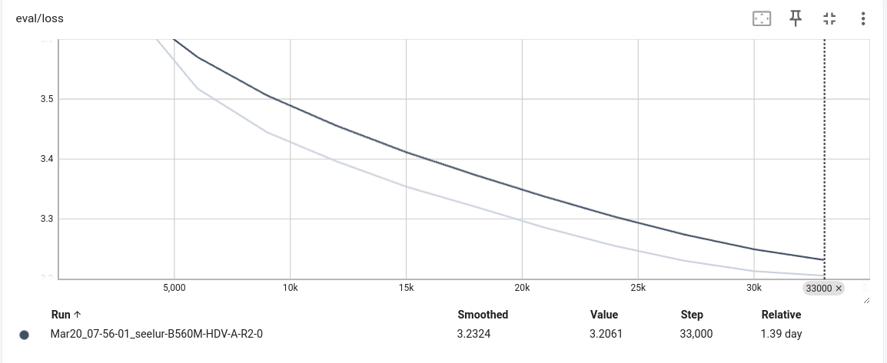
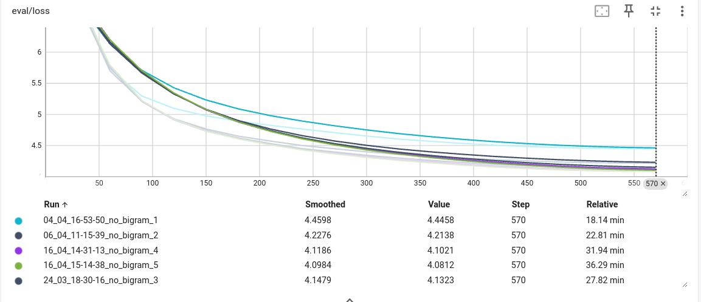
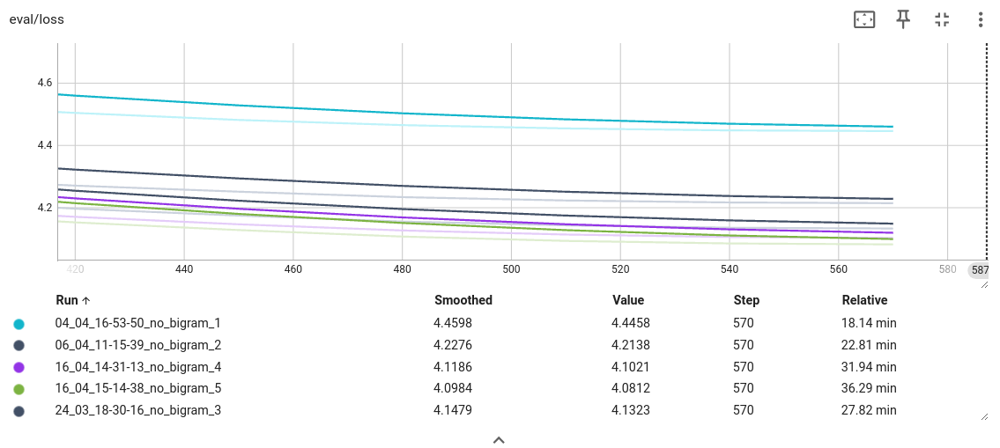
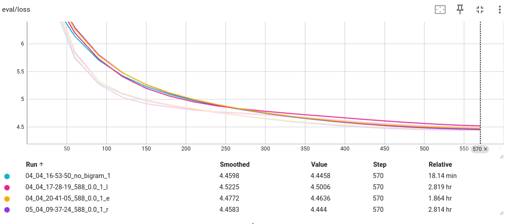
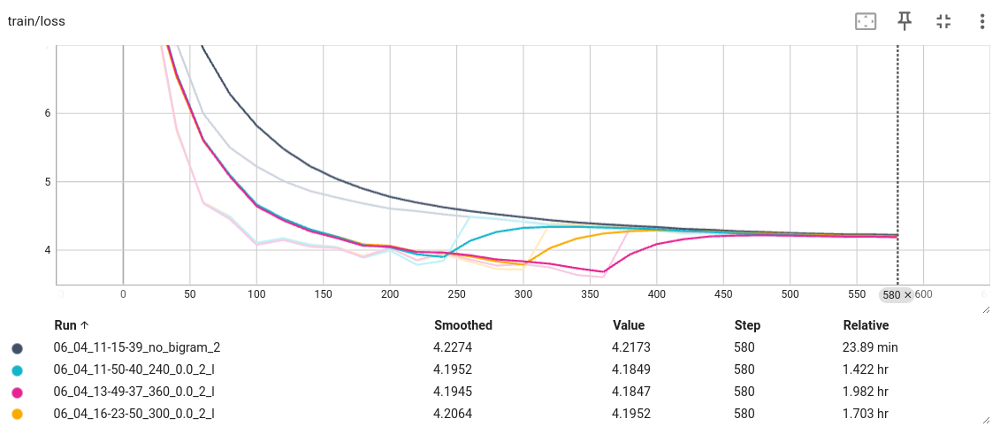
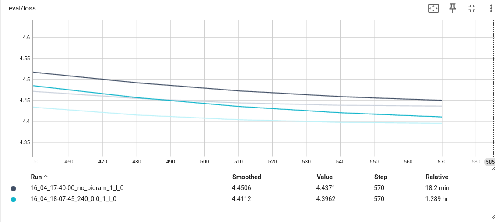
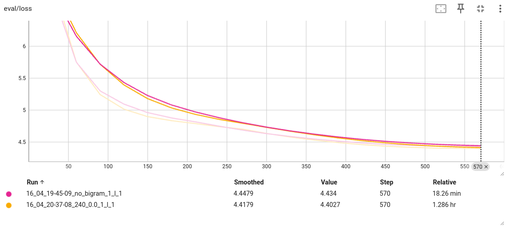
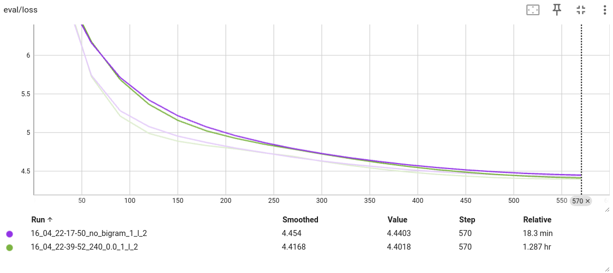
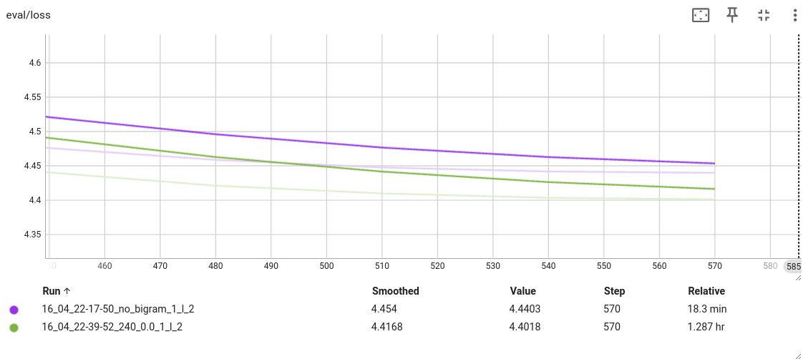
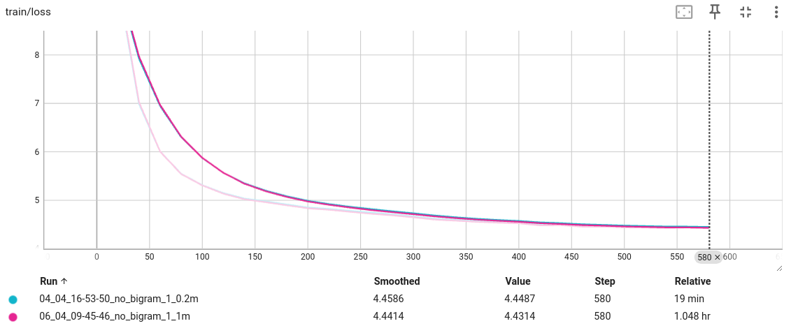

# Base model
Model: small-llama2. https://huggingface.co/TinyPixel/small-llama2

# Overall conclusion
Even a simple and small language model, like bigram model, can help improving a large language model's performance on the validation dataset. More details can be found in experiments of k-fold validation.

# Full pre-training on the full dataset
Dataset: Bookcorpus, shuffled. The random seed is 42. 80% of the data are used as the training data, and 20% of the data are used as the validation set. 
The number of layers: 6
Data directory: ./llama2-small-bigram-guided/runs/Mar20_07-56-01_seelur-B560M-HDV-A-R2-0

# The number of model layers VS the validation loss
In these experiments, I explored the performances of models with different layer numbers, identifying the contributions of layer numbers.

Dataset: Bookcorpus, shuffled. The random seed is 42. 80% of the data are used as the training data, and 20% of the data are used as the validation set. But only the first 1_000_000 rows from the training set are used for training, and only the first 200_000 from the validation set are used for validation. The reason for this is limited computing resources. 

The number of layers: ranges from 1 to 5
- Data directory: ./llama2-tiny-bigram-guided/runs/04_04_16-53-50_no_bigram_1
- Data directory: ./llama2-tiny-bigram-guided/runs/06_04_11-15-39_no_bigram_2
- Data directory: ./llama2-tiny-bigram-guided/runs/24_03_18-30-16_no_bigram_3
- Data directory: ./llama2-tiny-bigram-guided/runs/16_04_14-31-13_no_bigram_4
- Data directory: ./llama2-tiny-bigram-guided/runs/16_04_15-14-38_no_bigram_5

# Exponential scheduling, Reciprocal scheduling and Linear scheduling
In these experiments, I explored three different teacher-student scheduling methods.

Dataset: Bookcorpus, shuffled. The random seed is 42. 80% of the data are used as the training data, and 20% of the data are used as the validation set. But only the first 1_000_000 rows from the training set are used for training, and only the first 200_000 from the validation set are used for validation. The reason for this is limited computing resources. 

The number of layers: 1
- Data directory: ./llama2-tiny-bigram-guided/runs/04_04_16-53-50_no_bigram_1  
- Data directory: ./llama2-tiny-bigram-guided/runs/04_04_17-28-19_588_0.0_1_l  
- Data directory: ./llama2-tiny-bigram-guided/runs/04_04_20-41-05_588_0.0_1_e  
- Data directory: ./llama2-tiny-bigram-guided/runs/05_04_09-37-24_588_0.0_1_r  

Notes for directories name: day_month_hour-minute-second-{scheduling steps}-{minimum weight of the teacher}-{number of model layers}-{scheduling type}  
l: linear scheduling  
e: exponential scheduling  
r: reciprocal scheduling  

# Linear scheduling with different scheduling steps
In these experiments, I explored the influence of scheduling steps.

Dataset: Bookcorpus, shuffled. The random seed is 42. 80% of the data are used as the training data, and 20% of the data are used as the validation set. But only the first 1_000_000 rows from the training set are used for training, and only the first 200_000 from the validation set are used for validation. The reason for this is limited computing resources. 

The number of layers: 2
Scheduling method: linear scheduling
- Data directory: ./llama2-tiny-bigram-guided/runs/06_04_11-15-39_no_bigram_2  
- Data directory: ./llama2-tiny-bigram-guided/runs/06_04_11-50-40_240_0.0_2_l  
- Data directory: ./llama2-tiny-bigram-guided/runs/06_04_13-49-37_360_0.0_2_l  
- Data directory: ./llama2-tiny-bigram-guided/runs/06_04_16-23-50_300_0.0_2_l  

Notes for directories name: day_month_hour-minute-second-{scheduling steps}-{minimum weight of the teacher}-{number of model layers}-{scheduling type}  
l: linear scheduling  
e: exponential scheduling  
r: reciprocal scheduling  

Conclusion: 
- First, the bigram guided pre-training out performance original pre-training on the validation dataset; 
- Second, The bigram guided pre-training has the lowest validation loss when the scheduling steps are 240. 

# K-fold validation
In these experiments, I utilized k-fold validation method to verify if the improvement by the teacher-student paradigm is stable.

Dataset: Bookcorpus, shuffled. The random seed is 42. The whole dataset are split into 5 even parts (5-fold validation). But, only the first 250_000 rows from the each training fold are selected for constructing the final training dataset, and only the first 200_000 from the validation part are used for constructing the validation dataset. The reason for this is limited computing resources. 

The number of layers: 1
Scheduling method: linear scheduling

- Data directory: ./llama2-bigram-guided-k-fold/runs/16_04_17-40-00_no_bigram_1_l_0 
- Data directory: ./llama2-bigram-guided-k-fold/runs/16_04_18-07-45_240_0.0_1_l_0

- Data directory: ./llama2-bigram-guided-k-fold/runs/16_04_19-45-09_no_bigram_1_l_1
- Data directory: ./llama2-bigram-guided-k-fold/runs/16_04_20-37-08_240_0.0_1_l_1

- Data directory: ./llama2-bigram-guided-k-fold/runs/16_04_22-17-50_no_bigram_1_l_2
- Data directory: ./llama2-bigram-guided-k-fold/runs/16_04_22-39-52_240_0.0_1_l_2

- Data directory: ./llama2-bigram-guided-k-fold/runs/17_04_09-16-10_no_bigram_1_l_3
- Data directory: ./llama2-bigram-guided-k-fold/runs/17_04_09-41-43_240_0.0_1_l_3

- Data directory: ./llama2-bigram-guided-k-fold/runs/17_04_19-47-51_no_bigram_1_l_4
- Data directory: ./llama2-bigram-guided-k-fold/runs/17_04_18-07-11_240_0.0_1_l_4

Notes for directories name: day_month_hour-minute-second-{scheduling steps}-{minimum weight of the teacher}-{number of model layers}-{scheduling type}-{k-fold order number}

l: linear scheduling  
e: exponential scheduling  
r: reciprocal scheduling  

Fold 0：  

  
Fold 1：  

  
Fold 2：  

  
Fold 3：  

  
Fold 4：  

  
Fold 0-4：  

Conclusion: 
- The improvement introduced by the bigram model are stable among different validation sets. 

# Larger validation set
In these experiments, I explored the influence of size of the validation set.  

Dataset: Bookcorpus, shuffled. The random seed is 42. 80% of the data are used as the training data, and 20% of the data are used as the validation set. But only the first 1_000_000 rows from the training set are used for training. As for validation set, its sizes are 0.2 million and 1 million. The reason for this is limited computing resources. 

The number of layers: 1
Scheduling method: linear scheduling
- Data directory: ./llama2-tiny-bigram-guided-large-validation-set/runs/04_04_16-53-50_no_bigram_1_0.2m
- Data directory: ./llama2-tiny-bigram-guided-large-validation-set/runs/06_04_09-45-46_no_bigram_1_1m

Notes for directories name: day_month_hour-minute-second-no_bigram-{number of model layers}-{validation dataset size}  

Conclusion: 
- With the increment of the validation dataset size, the validation loss did not rise.

