# LLM_pre_training_acceleration

## Research question
Knowledge distillation has been used to help a smaller model to perform almost the same as a larger model in the language modeling field.[1] While training, the loss function is usually combined with distillation loss over the target distribution and a task-specific loss.[2] However, there is no research showing that a small language model can be a teacher of a large language model during the early stage of pre-training. Whether the large language model learns faster or not? Whether the large language model perform better during the evaluation? At the early stage of pre-training, a large language model should be inferior compared to a trained small language model. Therefore, a large language model can learn from a smaller one, and possibly  learn faster than without a teacher model. Because of the huge consumption of energy for large language model pre-training, possible ways to reduce pre-training steps or to accelerate pre-training are valuable.  

## Experiment set-ups

## Loss function
Loss function is defined as following:

$$ Loss_{b} = -\sum_{k=1}^N (p_{bi-gram, k} * weight + p_{one-hot, k} * (1 - weight))log{p_{model, k}} $$
Where N is the size of the vocabulary, $p_{bi-gram}$ is the bi-gram probability vector, $p_{one-hot}$ is the one-hot label, and $p_{model}$ is the model prediction.

## Datasets
The datasets for these experiments are Bookcorpus (https://huggingface.co/datasets/bookcorpus). Bookcorpus is split into a training set (80%) and a validation set (20%), under the random seed 42. 

However, only partial training data and validation data are used for large language model pre-training, because only the early stage of pre-training is studied here. 

### Model
Reference model name: TinyPixel/small-llama2  
URL: https://huggingface.co/TinyPixel/small-llama2

During the experiment, model layers are reduced to 3 layers. the other model parameters are kept the same.

### Small language model
Here, a bi-gram language model is used as a small language model, because of its simplicity and computation efficiency. Bi-gram probabilities are calculated on the training dataset, not including the validation set.  

### Experiment 1
This is a controlled experiment, i.e. the 3-layer-small-llama2 is trained in a traditional way.

### Experiment 2
In this experiment, the 3-layer-small-llama2 is trained based on the $Loss_b$ function. During pre-training, linear teaching scheduling was applied, which means, the weight of bi-gram probabilities decreases linearly against the number of training steps. The maximum teaching scheduling step is 100. After the first 100 steps, the weight of the bi-gram probabilities is fixed at 0.05.  

### Experiment 3
In this experiment, the 3-layer-small-llama2 is trained based on the Loss function. During pre-training, the maximum teaching scheduling step is 100. After the first 100 steps, the weight of the bi-gram probabilities is fixed to 0 (i.e. no teacher anymore). 

### More experiments
Please read Experiments.md for more information.

# Results
## Overall conclusion
Even a simple and small language model, like bigram model, can help improving a large language model's performance on the validation dataset. More details can be found in experiments of k-fold validation.

## Full pre-training on the full dataset
Dataset: Bookcorpus, shuffled. The random seed is 42. 80% of the data are used as the training data, and 20% of the data are used as the validation set. 
The number of layers: 6
Data directory: ./llama2-small-bigram-guided/runs/Mar20_07-56-01_seelur-B560M-HDV-A-R2-0
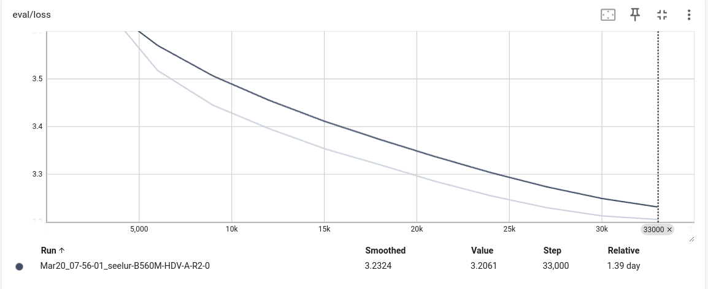
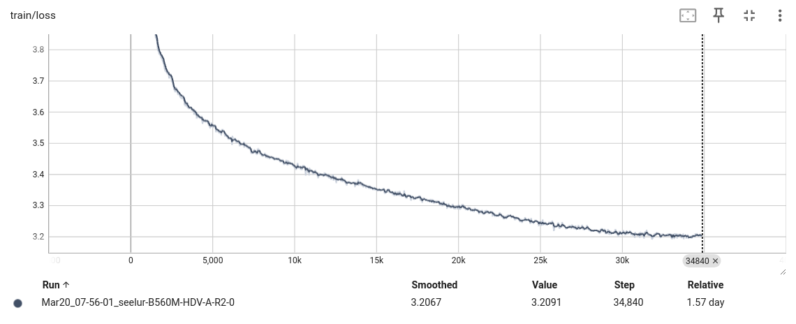

## The number of model layers VS the validation loss
In these experiments, I explored the performances of models with different layer numbers, identifying the contributions of layer numbers.

Dataset: Bookcorpus, shuffled. The random seed is 42. 80% of the data are used as the training data, and 20% of the data are used as the validation set. But only the first 1_000_000 rows from the training set are used for training, and only the first 200_000 from the validation set are used for validation. The reason for this is limited computing resources. 

The number of layers: ranges from 1 to 5
- Data directory: ./llama2-tiny-bigram-guided/runs/04_04_16-53-50_no_bigram_1
- Data directory: ./llama2-tiny-bigram-guided/runs/06_04_11-15-39_no_bigram_2
- Data directory: ./llama2-tiny-bigram-guided/runs/24_03_18-30-16_no_bigram_3
- Data directory: ./llama2-tiny-bigram-guided/runs/16_04_14-31-13_no_bigram_4
- Data directory: ./llama2-tiny-bigram-guided/runs/16_04_15-14-38_no_bigram_5

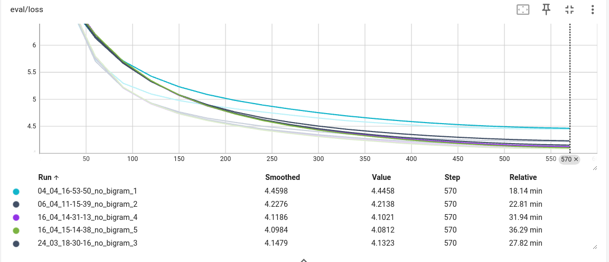
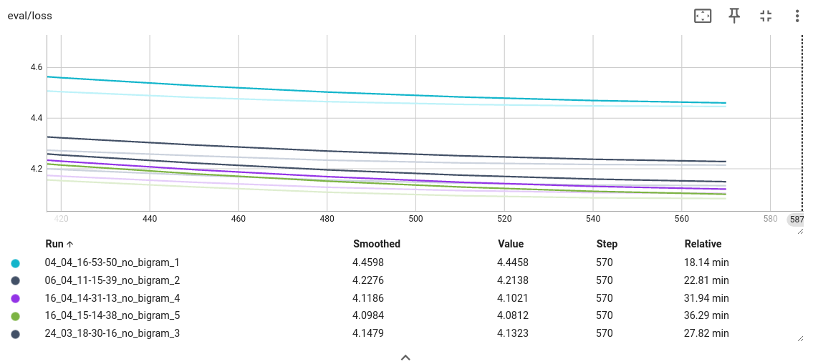
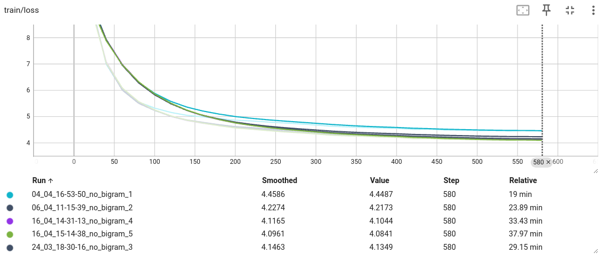

## Exponential scheduling, Reciprocal scheduling and Linear scheduling
In these experiments, I explored three different teacher-student scheduling methods.

Dataset: Bookcorpus, shuffled. The random seed is 42. 80% of the data are used as the training data, and 20% of the data are used as the validation set. But only the first 1_000_000 rows from the training set are used for training, and only the first 200_000 from the validation set are used for validation. The reason for this is limited computing resources. 

The number of layers: 1
- Data directory: ./llama2-tiny-bigram-guided/runs/04_04_16-53-50_no_bigram_1  
- Data directory: ./llama2-tiny-bigram-guided/runs/04_04_17-28-19_588_0.0_1_l  
- Data directory: ./llama2-tiny-bigram-guided/runs/04_04_20-41-05_588_0.0_1_e  
- Data directory: ./llama2-tiny-bigram-guided/runs/05_04_09-37-24_588_0.0_1_r  

Notes for directories name: day_month_hour-minute-second-{scheduling steps}-{minimum weight of the teacher}-{number of model layers}-{scheduling type}  
l: linear scheduling  
e: exponential scheduling  
r: reciprocal scheduling  

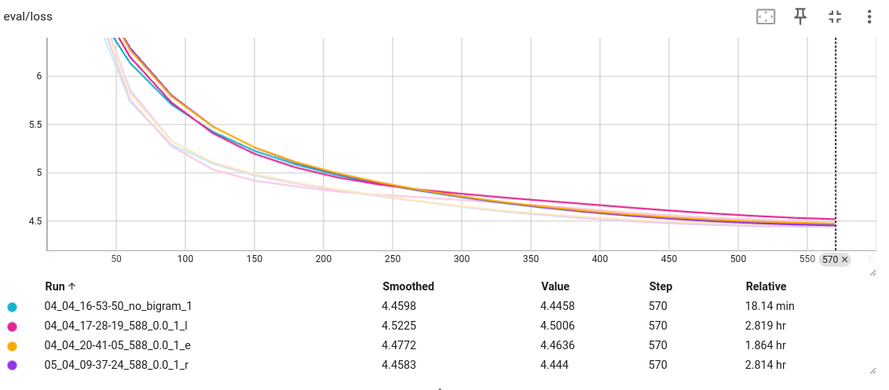
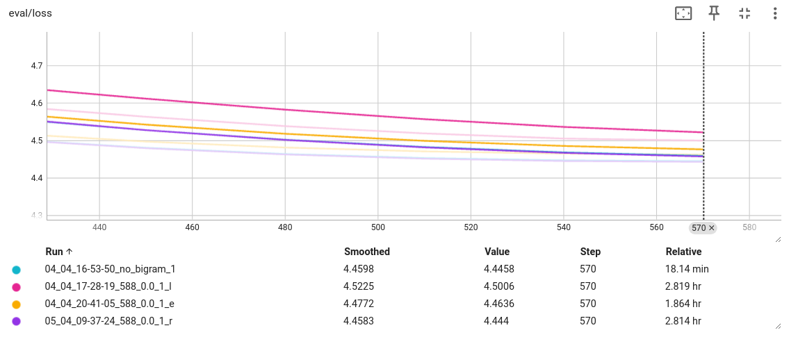
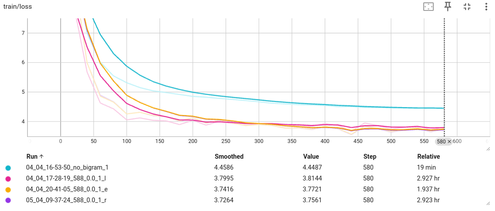

## Linear scheduling with different scheduling steps
In these experiments, I explored the influence of scheduling steps.

Dataset: Bookcorpus, shuffled. The random seed is 42. 80% of the data are used as the training data, and 20% of the data are used as the validation set. But only the first 1_000_000 rows from the training set are used for training, and only the first 200_000 from the validation set are used for validation. The reason for this is limited computing resources. 

The number of layers: 2
Scheduling method: linear scheduling
- Data directory: ./llama2-tiny-bigram-guided/runs/06_04_11-15-39_no_bigram_2  
- Data directory: ./llama2-tiny-bigram-guided/runs/06_04_11-50-40_240_0.0_2_l  
- Data directory: ./llama2-tiny-bigram-guided/runs/06_04_13-49-37_360_0.0_2_l  
- Data directory: ./llama2-tiny-bigram-guided/runs/06_04_16-23-50_300_0.0_2_l  

Notes for directories name: day_month_hour-minute-second-{scheduling steps}-{minimum weight of the teacher}-{number of model layers}-{scheduling type}  
l: linear scheduling  
e: exponential scheduling  
r: reciprocal scheduling  

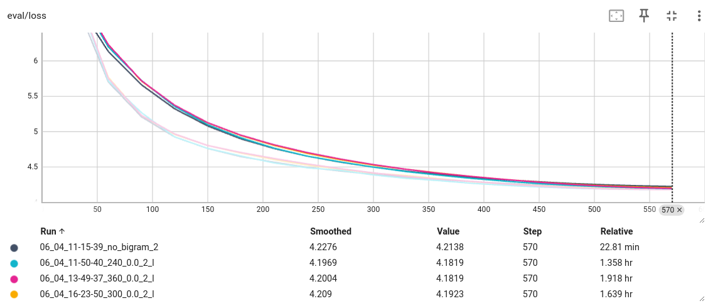
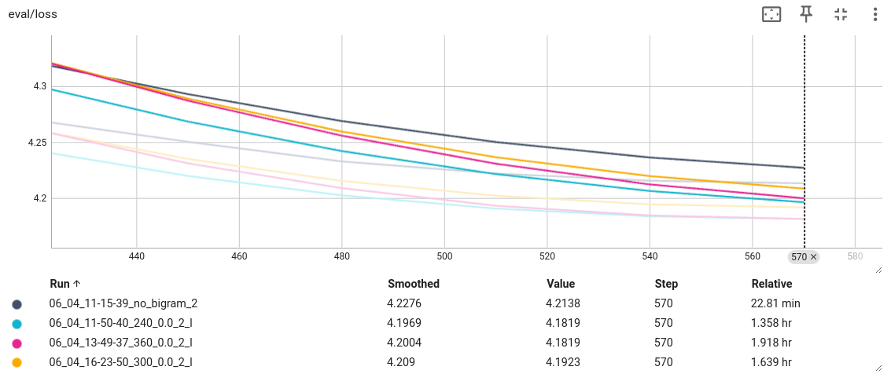
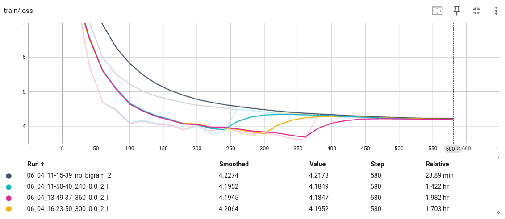

Conclusion: 
- First, the bigram guided pre-training out performance original pre-training on the validation dataset; 
- Second, The bigram guided pre-training has the lowest validation loss when the scheduling steps are 240. 

## K-fold validation
In these experiments, I utilized k-fold validation method to verify if the improvement by the teacher-student paradigm is stable.

Dataset: Bookcorpus, shuffled. The random seed is 42. The whole dataset are split into 5 even parts (5-fold validation). But, only the first 250_000 rows from the each training fold are selected for constructing the final training dataset, and only the first 200_000 from the validation part are used for constructing the validation dataset. The reason for this is limited computing resources. 

The number of layers: 1
Scheduling method: linear scheduling

- Data directory: ./llama2-bigram-guided-k-fold/runs/16_04_17-40-00_no_bigram_1_l_0 
- Data directory: ./llama2-bigram-guided-k-fold/runs/16_04_18-07-45_240_0.0_1_l_0

- Data directory: ./llama2-bigram-guided-k-fold/runs/16_04_19-45-09_no_bigram_1_l_1
- Data directory: ./llama2-bigram-guided-k-fold/runs/16_04_20-37-08_240_0.0_1_l_1

- Data directory: ./llama2-bigram-guided-k-fold/runs/16_04_22-17-50_no_bigram_1_l_2
- Data directory: ./llama2-bigram-guided-k-fold/runs/16_04_22-39-52_240_0.0_1_l_2

- Data directory: ./llama2-bigram-guided-k-fold/runs/17_04_09-16-10_no_bigram_1_l_3
- Data directory: ./llama2-bigram-guided-k-fold/runs/17_04_09-41-43_240_0.0_1_l_3

- Data directory: ./llama2-bigram-guided-k-fold/runs/17_04_19-47-51_no_bigram_1_l_4
- Data directory: ./llama2-bigram-guided-k-fold/runs/17_04_18-07-11_240_0.0_1_l_4

Notes for directories name: day_month_hour-minute-second-{scheduling steps}-{minimum weight of the teacher}-{number of model layers}-{scheduling type}-{k-fold order number}

l: linear scheduling  
e: exponential scheduling  
r: reciprocal scheduling  

Fold 0：  
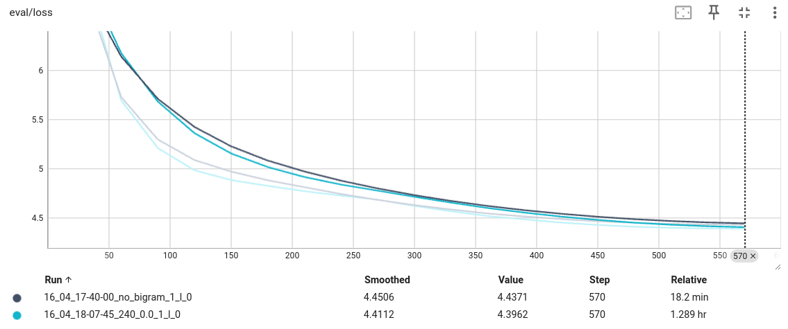
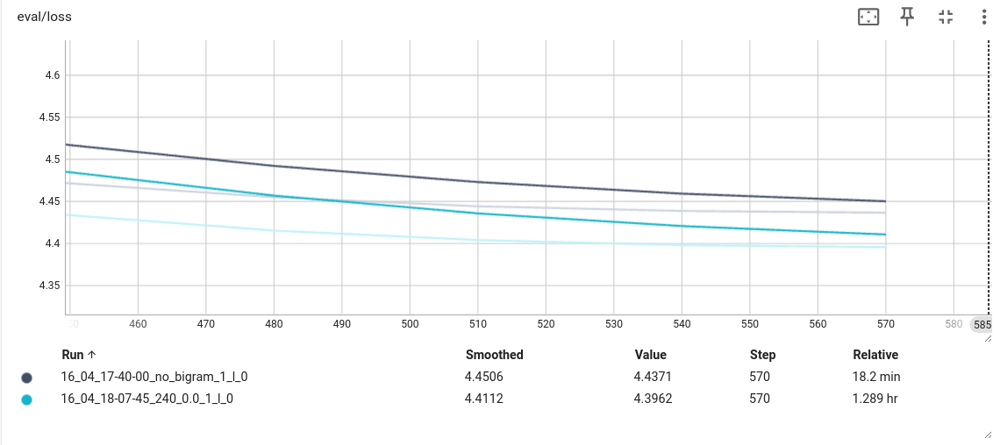  
Fold 1：  
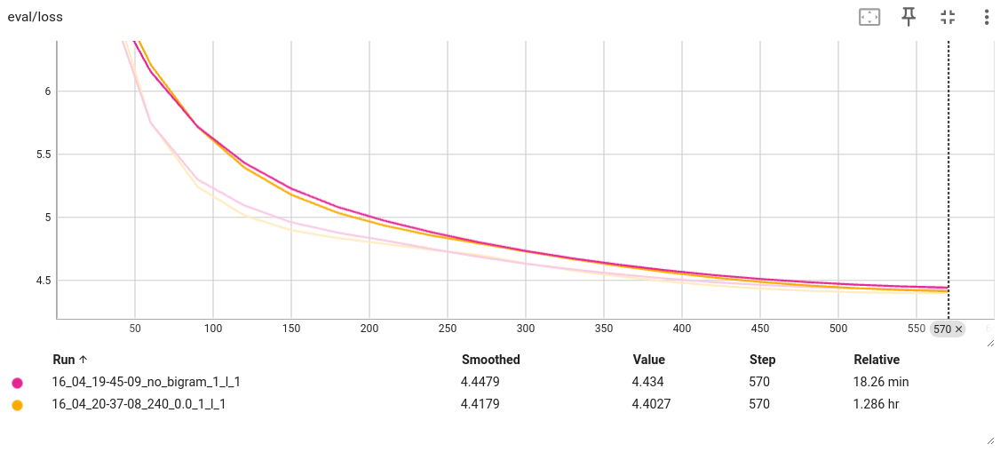
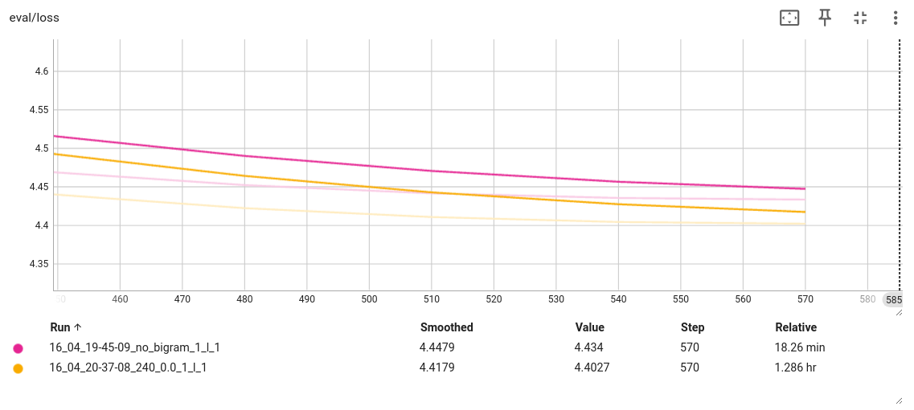  
Fold 2：  
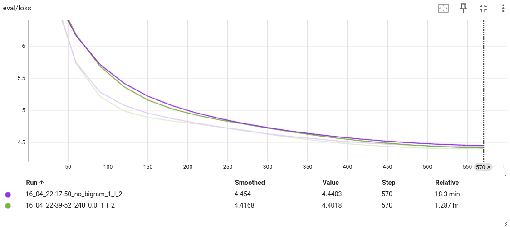
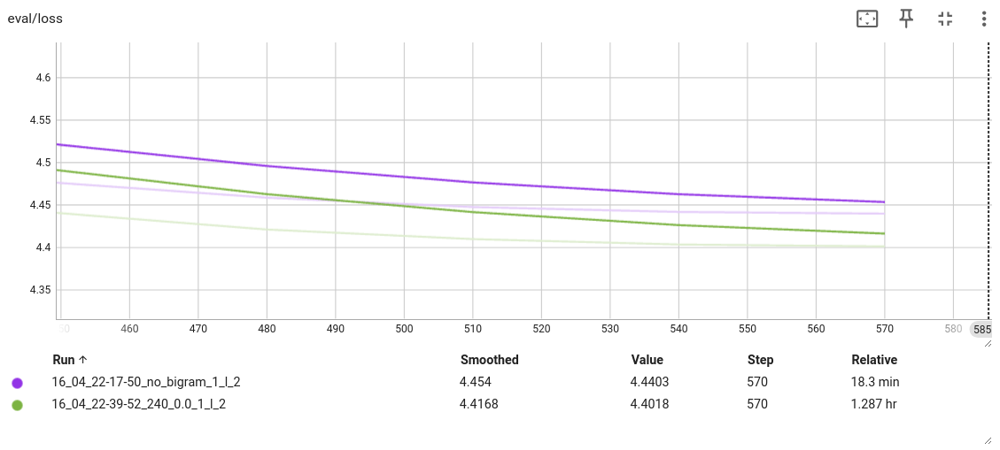  
Fold 3：  
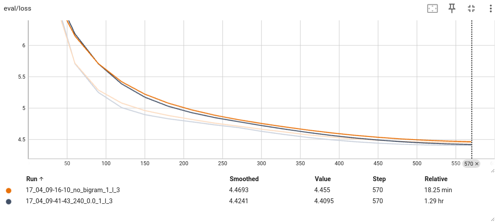
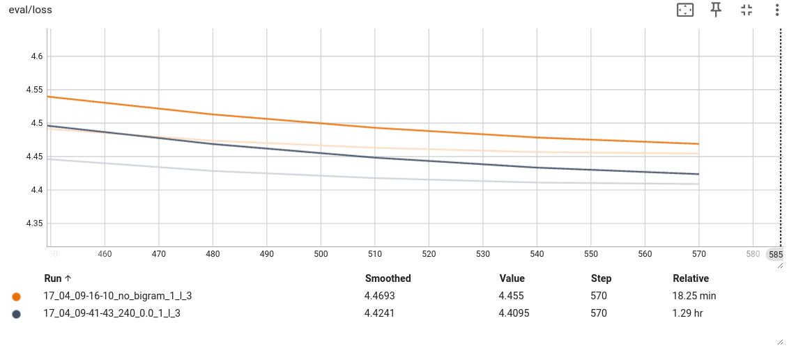  
Fold 4：  
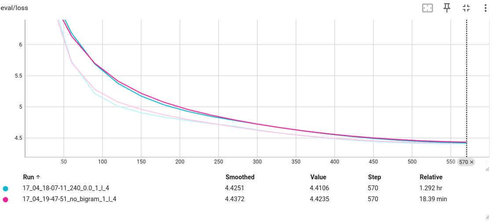
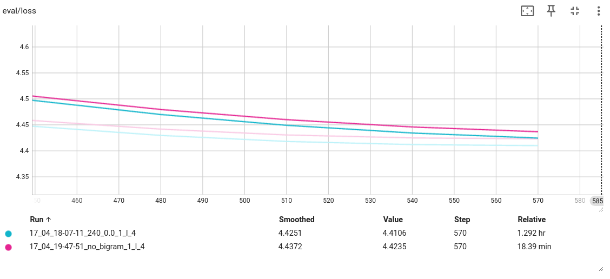  
Fold 0-4：  
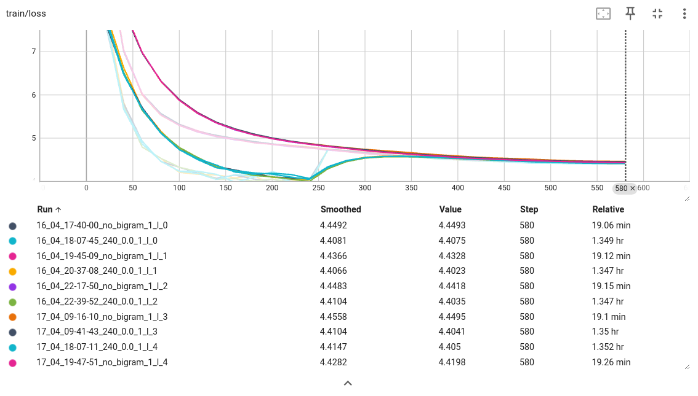

Conclusion: 
- The improvement introduced by the bigram model are stable among different validation sets. 

## Larger validation set
In these experiments, I explored the influence of size of the validation set.  

Dataset: Bookcorpus, shuffled. The random seed is 42. 80% of the data are used as the training data, and 20% of the data are used as the validation set. But only the first 1_000_000 rows from the training set are used for training. As for validation set, its sizes are 0.2 million and 1 million. The reason for this is limited computing resources. 

The number of layers: 1
Scheduling method: linear scheduling
- Data directory: ./llama2-tiny-bigram-guided-large-validation-set/runs/04_04_16-53-50_no_bigram_1_0.2m
- Data directory: ./llama2-tiny-bigram-guided-large-validation-set/runs/06_04_09-45-46_no_bigram_1_1m

Notes for directories name: day_month_hour-minute-second-no_bigram-{number of model layers}-{validation dataset size}  

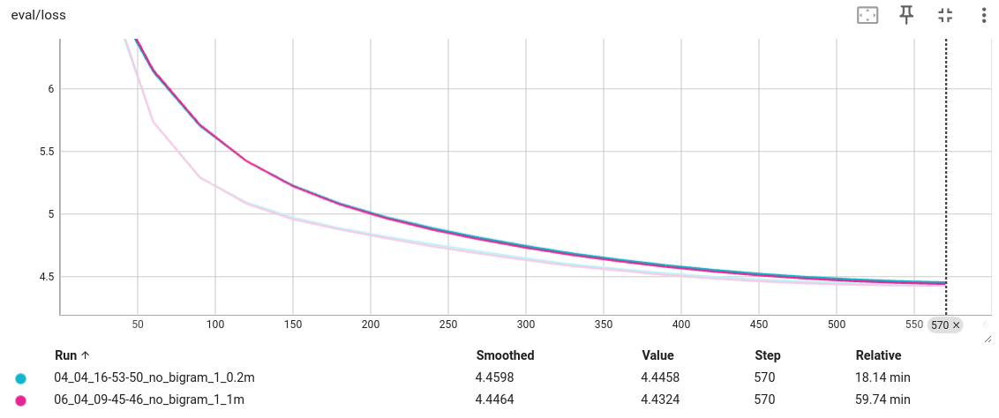
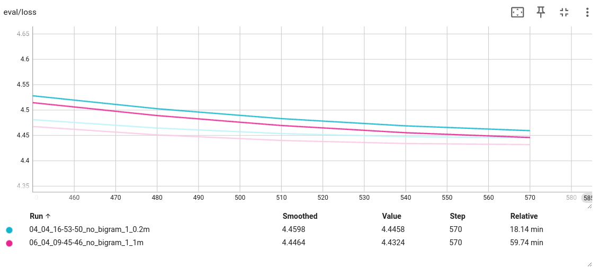
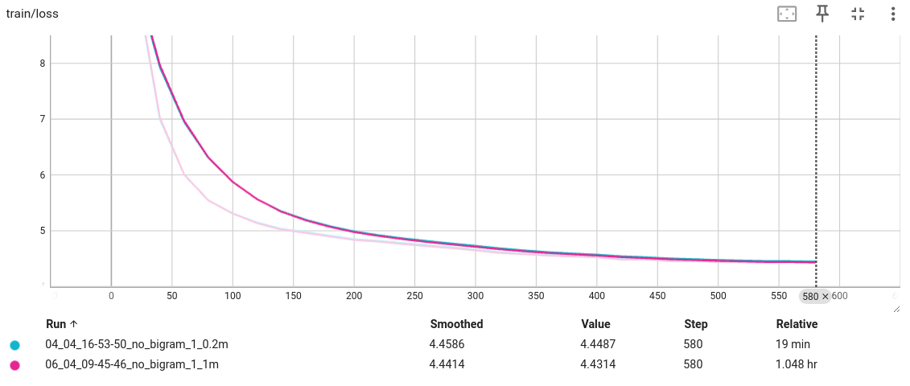

Conclusion: 
- With the increment of the validation dataset size, the validation loss did not rise.

## references
[1] @misc{wu2022causal,
      title={Causal Distillation for Language Models}, 
      author={Zhengxuan Wu and Atticus Geiger and Josh Rozner and Elisa Kreiss and Hanson Lu and Thomas Icard and Christopher Potts and Noah D. Goodman},
      year={2022},
      eprint={2112.02505},
      archivePrefix={arXiv},
      primaryClass={cs.CL}
}  
[2] @misc{sanh2020distilbert,
      title={DistilBERT, a distilled version of BERT: smaller, faster, cheaper and lighter}, 
      author={Victor Sanh and Lysandre Debut and Julien Chaumond and Thomas Wolf},
      year={2020},
      eprint={1910.01108},
      archivePrefix={arXiv},
      primaryClass={cs.CL}
}

